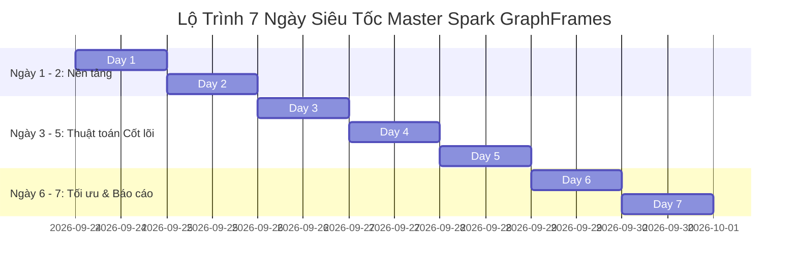

# KẾ HOẠCH HỌC TẬP & NGHIÊN CỨU SPARK GRAPHFRAMES SIÊU TỐC (7 NGÀY / 1 TUẦN)
> **Chế độ:** Toàn thời gian (Full-time Intensive Bootcamp - 8-10h/ngày).  
> **Mục tiêu:** Đưa Quân từ con số 0 (Python lâu chưa dùng, SQL căn bản) làm chủ hoàn toàn **Apache Spark & GraphFrames**, hiểu sâu bản chất toán học, chạy thực nghiệm mượt mà các thuật toán cốt lõi (**LPA**, **PageRank**, **Connected Components**, **BFS**, **Motif Finding**) và tối ưu hóa phân tán trên MacBook M3.

---

## 🎯 BỐI CẢNH & CHỈ TIÊU KỸ THUẬT
* **Thành viên:** Đặng Minh Quân (Lead thực thi), bạn Thành, dưới sự hướng dẫn của thầy Đặng.
* **Môi trường thực thi:** MacBook Air M3 (Apple Silicon), PySpark `4.0.4`, GraphFrames `0.6` (JAR: `io.graphframes:graphframes-spark4_2.13:0.12.2`), venv nội bộ (`./venv`).
* **Chuẩn mực kỹ thuật:**
  1. Mọi thuật toán tuân thủ khung tư duy 4 bước: **Mô hình hóa $\to$ Xác lập tiệm cận $\to$ Bất biến & Độ phức tạp $\to$ Kiểm thử đối nghịch**.
  2. Đo lường thời gian chạy (Execution Time) và mức tiêu thụ RAM (`psutil`).
  3. Cắt tỉa DAG lineage chống tràn bộ đệm JVM (`sparkContext.setCheckpointDir`).

---

## 📅 LỊCH TRÌNH 7 NGÀY SIÊU TỐC (TIMELINE GANTT)



---

## 📖 CHI TIẾT LỘ TRÌNH TỪNG NGÀY (DAILY FULL-TIME SCHEDULE)

### 🟢 NGÀY 1: NỀN TẢNG PYSPARK DATAFRAME & KIẾN TRÚC PHÂN TÁN
*Mục tiêu: Đưa tư duy SQL sẵn có sang PySpark DataFrame API, hiểu bản chất Lazy Evaluation & bộ máy Catalyst Optimizer.*

* **Buổi Sáng (8:30 - 12:00) | Tái khởi động Python & Ánh xạ SQL $\rightarrow$ PySpark:**
  - Ôn lại nhanh Python: Cấu trúc dữ liệu (Tuple, Dict, Set), List comprehension, hàm `lambda`.
  - Ánh xạ trực tiếp từ SQL sang PySpark:
    - `SELECT col1, col2` $\rightarrow$ `df.select("col1", "col2")`
    - `WHERE col > 10` $\rightarrow$ `df.filter(F.col("col") > 10)`
    - `GROUP BY col COUNT(*)` $\rightarrow$ `df.groupBy("col").count()`
    - `JOIN` $\rightarrow$ `df1.join(df2, on="id", how="inner")`
    - `CASE WHEN ... THEN ... ELSE` $\rightarrow$ `F.when().otherwise()`
  - Nắm vững `pyspark.sql.functions as F` (`F.explode`, `F.split`, `F.col`, `F.coalesce`).
* **Buổi Chiều (13:30 - 17:30) | Cơ chế vận hành bên dưới của Spark (Spark Internals):**
  - **Lazy Evaluation & DAG:** Hiểu tại sao lệnh Transformation không chạy ngay; chỉ có Action (`count()`, `show()`, `collect()`) mới kích hoạt Spark Job.
  - **Narrow vs Wide Transformation (Shuffle):** Phân biệt các phép toán cục bộ (`map`, `filter`) và các phép toán gây xáo trộn mạng dữ liệu (`groupBy`, `join`, `distinct`).
  - Dùng `df.explain(True)` để đọc hiểu Logical Plan và Physical Plan do Spark tối ưu.
* **Buổi Tối (19:30 - 21:30) | Xây dựng khung đo lường (Profiler Module):**
  - Viết module đo thời gian và RAM (`psutil`) tại `src/utils/profiler.py` theo quy chuẩn dự án.
  - Cấu hình chuẩn cho Mac M3: `local[4]`, `spark.sql.shuffle.partitions = 4`.
  - **Sản phẩm Ngày 1:** File script test DataFrame hoàn chỉnh và module đo hiệu năng.

---

### 🟢 NGÀY 2: CẤU TRÚC ĐỒ THỊ VỚI GRAPHFRAMES & ĐỘ ĐO BẬC (DEGREES)
*Mục tiêu: Biến đổi dữ liệu dạng bảng thành mô hình đồ thị thuộc tính (Property Graph) và phân tích các nút mạng.*

* **Buổi Sáng (8:30 - 12:00) | Mô hình Đồ thị & Khởi tạo GraphFrame:**
  - Khái niệm Property Graph $G = (V, E)$:
    - Bảng Đỉnh (`vertices`): Bắt buộc chứa cột khóa chính `id` + các trường đặc trưng.
    - Bảng Cạnh (`edges`): Bắt buộc chứa `src` (nguồn) và `dst` (đích) + trọng số/thời gian.
  - Tạo GraphFrame từ DataFrames: `g = GraphFrame(vertices, edges)`.
  - Thao tác trích xuất và lọc đồ thị con (Subgraphs):
    - `g.filterVertices("balance > 10000")`
    - `g.filterEdges("amount > 5000")`
    - `g.dropIsolatedVertices()`
* **Buổi Chiều (13:30 - 17:30) | Phân tích Bậc của đỉnh (Degree Centrality):**
  - `g.inDegrees`: Bậc vào (nút nhận dòng tiền / người nhận thông tin).
  - `g.outDegrees`: Bậc ra (nút rải tiền / người phát tán thông tin).
  - `g.degrees`: Tổng số liên kết trực tiếp.
  - Tìm kiếm **Hubs** (các nút có độ kết nối đột biến) và **Isolated Nodes** (nút cô lập).
* **Buổi Tối (19:30 - 21:30) | Kiểm thử đối nghịch đồ thị:**
  - Tự sinh các trường hợp suy biến: Đồ thị rỗng, đồ thị tự lặp (`src == dst`), đa cạnh giữa hai đỉnh (multigraph).
  - **Sản phẩm Ngày 2:** Script `src/graph_builder.py` chuẩn hóa việc nạp dữ liệu thô sang GraphFrame.

---

### 🟡 NGÀY 3: KHAI PHÁ MẪU HÌNH ĐỒ THỊ (MOTIF FINDING) & BÀI TOÁN GIAN LẬN
*Mục tiêu: Làm chủ ngôn ngữ truy vấn mẫu hình đồ thị (Graph DSL) để phát hiện chu trình xoay vòng vốn và tam giác liên kết.*

* **Buổi Sáng (8:30 - 12:00) | Cú pháp Motif Finding DSL:**
  - Cú pháp cơ bản: `g.find("(a)-[e1]->(b); (b)-[e2]->(c)")`.
  - Cạnh vô hướng và điều kiện phủ định: `!(a)-[]->(b)`.
  - Phân tích chi phí: Hiểu vì sao Motif Finding bản chất là các phép `JOIN` liên tiếp trên bảng `edges`.
* **Buổi Chiều (13:30 - 17:30) | Bài toán thực chiến: Phát hiện Chu trình Rửa tiền / Gian lận:**
  - Mô hình hóa chu trình 3 đỉnh $K_3$ ($A \to B \to C \to A$) và 4 đỉnh $K_4$ ($A \to B \to C \to D \to A$).
  - **Kỹ thuật khử trùng lặp hoán vị (Symmetry Breaking):**
    - Lọc điều kiện: `filter("a.id < b.id AND b.id < c.id")` để tránh đếm 1 chu trình 3 lần ($A \to B \to C$, $B \to C \to A$, $C \to A \to B$).
  - Đếm tam giác liên kết (`g.triangleCount()`).
* **Buổi Tối (19:30 - 21:30) | Tối ưu hóa truy vấn Motif:**
  - Lọc cạnh trước khi đưa vào motif (`g.edges.filter(...)`) để giảm thiểu số dòng join.
  - **Sản phẩm Ngày 3:** Script `src/motif_detector.py` có khả năng phát hiện và tính tổng tiền bị xoay vòng tự động.

---

### 🟠 NGÀY 4: TRỌNG TÂM: THUẬT TOÁN LAN TRUYỀN NHÃN (LABEL PROPAGATION - LPA)
*Mục tiêu: Đột phá yêu cầu cốt lõi từ thầy Đăng và bài viết HackerNoon: Phân cụm cộng đồng mạng quy mô lớn.*

* **Buổi Sáng (8:30 - 12:00) | Bản chất Toán học của Thuật toán Raghavan (2007):**
  - Định nghĩa bài toán Phát hiện cộng đồng không giám sát (*Unsupervised Community Detection*).
  - Thuật toán 4 bước chi tiết:
    1. **Khởi tạo:** Mỗi đỉnh $v \in V$ mang nhãn riêng biệt $C_v^{(0)} = v$.
    2. **Lan truyền (Message Passing):** Ở bước lặp $t$, mỗi nút nhận nhãn từ tất cả các nút lân cận $u \in N(v)$.
    3. **Biểu quyết đa số (Majority Voting):** Nút cập nhật nhãn theo số đông:
       $$C_v^{(t)} = \operatorname{argmax}_c \sum_{u \in N(v)} \mathbb{I}(C_u^{(t-1)} = c)$$
    4. **Dừng:** Khi mạng đạt cân bằng hoặc đạt số vòng lặp tối đa `maxIter`.
  - Đọc và phân tích bài viết HackerNoon: Cách thuật toán gom các chủ đề Wikipedia dựa trên tần suất đồng xuất hiện.
* **Buổi Chiều (13:30 - 17:30) | Thực thi LPA trên GraphFrames:**
  - Cú pháp thực thi:
    ```python
    communities = g.labelPropagation(maxIter=5)
    communities.groupBy("label").count().orderBy(F.desc("count")).show()
    ```
  - Khảo sát sự thay đổi của các cụm cộng đồng khi thay đổi `maxIter = 2, 5, 10, 15`.
  - Đo thời gian chạy và tiêu thụ RAM qua từng vòng lặp.
* **Buổi Tối (19:30 - 21:30) | Phân tích tiệm cận & Bẫy dao động nhãn (Label Oscillation):**
  - Độ phức tạp: $O(k \cdot (|V| + |E|))$ — gần như tuyến tính, tối ưu cho xử lý dữ liệu lớn.
  - Điểm yếu cần lưu ý để báo cáo với thầy: Tính không đơn nhất (Non-deterministic) và hiện tượng dao động nhãn trên đồ thị 2 phía (Bipartite graph).
  - **Sản phẩm Ngày 4:** Script `src/algorithms/lpa_runner.py` hoàn chỉnh và báo cáo phân tích thuật toán LPA.

---

### 🟠 NGÀY 5: PAGERANK, ĐỘ TRUNG TÂM & TÌM ĐƯỜNG ĐI NGẮN NHẤT (BFS)
*Mục tiêu: Đo lường tầm quan trọng/ảnh hưởng của các nút mạng và tìm lộ trình kết nối tối ưu.*

* **Buổi Sáng (8:30 - 12:00) | Thuật toán PageRank:**
  - Mô hình bước đi ngẫu nhiên (*Random Walk*) và hệ số ngắt quãng (*Damping factor* $\alpha = 0.85$, tương ứng `resetProbability = 0.15`).
  - Chạy PageRank tĩnh:
    ```python
    pr_result = g.pageRank(resetProbability=0.15, maxIter=10)
    pr_result.vertices.orderBy(F.desc("pagerank")).show()
    ```
  - Ứng dụng: Xác định tài khoản có dòng tiền chi phối hoặc tài khoản có nguy cơ rủi ro cao nhất.
* **Buổi Chiều (13:30 - 17:30) | Tìm đường đi ngắn nhất (Breadth-First Search - BFS):**
  - Tìm lộ trình giữa hai tập thực thể dựa trên biểu thức điều kiện:
    ```python
    paths = g.bfs(from_expr="id = 'ACC_103'", to_expr="account_type = 'Personal'", maxPathLength=4)
    ```
  - Tìm khoảng cách từ các điểm mốc (Landmarks): `g.shortestPaths(landmarks=['A', 'B'])`.
* **Buổi Tối (19:30 - 21:30) | Tích hợp Graph Features vào Machine Learning Pipeline:**
  - Gom các đặc trưng đồ thị (`pagerank`, `in_degree`, `out_degree`, `label_lpa`) vào vector đặc trưng (`VectorAssembler`).
  - Huấn luyện mô hình phân loại (Random Forest) như đã thử nghiệm trong `mini.ipynb`.
  - **Sản phẩm Ngày 5:** Script `src/algorithms/pagerank_bfs.py` và module trích xuất Graph Features.

---

### 🔴 NGÀY 6: PHÂN CỤM LIÊN THÔNG (CONNECTED & STRONGLY CONNECTED COMPONENTS)
*Mục tiêu: Tách biệt các cụm mạng độc lập, so sánh với LPA và hiểu cơ chế Two-Phase Algorithm.*

* **Buổi Sáng (8:30 - 12:00) | Connected Components (CC) cho Đồ thị Vô hướng:**
  - Khái niệm: Gom các đỉnh có bất kỳ đường đi nào nối với nhau vào chung một `component ID`.
  - Cơ chế **Two-Phase Algorithm** trong GraphFrames: Tối ưu phân tán để giảm chi phí trao đổi thông điệp qua mạng.
  - Cú pháp: `cc_df = g.connectedComponents()`.
* **Buổi Chiều (13:30 - 17:30) | Strongly Connected Components (SCC) cho Đồ thị Có hướng:**
  - Khái niệm: Đỉnh $u$ và $v$ thuộc cùng một SCC khi và chỉ khi có đường đi từ $u \to v$ VÀ từ $v \to u$.
  - Cú pháp: `scc_df = g.stronglyConnectedComponents(maxIter=10)`.
  - **So sánh 3 thuật toán phân cụm:**
    | Tiêu chí | Connected Components (CC) | Strongly Connected (SCC) | Label Propagation (LPA) |
    | :--- | :--- | :--- | :--- |
    | **Loại đồ thị** | Vô hướng (Undirected) | Có hướng (Directed) | Vô hướng / Có hướng |
    | **Bản chất cụm** | Rời rạc tuyệt đối (không có cạnh nối) | Chu trình khép kín 2 chiều | Mật độ liên kết dày đặc |
    | **Độ phức tạp** | $O(V + E)$ | Phụ thuộc đường đi đệ quy | $O(k \cdot (V + E))$ |
* **Buổi Tối (19:30 - 21:30) | Thử nghiệm phân vùng cụm tài khoản:**
  - Đánh giá sự cô lập của các nhóm tài khoản nghi vấn.
  - **Sản phẩm Ngày 6:** Script so sánh phân cụm `src/algorithms/components_runner.py`.

---

### 🔴 NGÀY 7: TỐI ƯU PHÂN TÁN NÂNG CAO, BENCHMARK DỮ LIỆU LỚN & BÁO CÁO TỔNG KẾT
*Mục tiêu: Đạt chuẩn nghiên cứu đỉnh cao: Chống tràn bộ nhớ JVM, benchmark trên dataset SNAP và hoàn thiện báo cáo cho nhóm.*

* **Buổi Sáng (8:30 - 12:00) | Kỹ thuật Sống còn trong Thuật toán Đồ thị Lặp (Iterative Execution):**
  - **Khắc phục lỗi kinh điển `StackOverflowError` trong JVM:**
    - Nguyên nhân: Thuật toán lặp (LPA, PageRank, CC) tạo ra chuỗi DAG Lineage quá dài làm tràn stack đệ quy.
    - Giải pháp bắt buộc: Cắt tỉa lineage bằng Checkpointing:
      ```python
      spark.sparkContext.setCheckpointDir("/tmp/spark-checkpoints")
      ```
  - **Quản lý bộ đệm:** Dùng `persist(StorageLevel.MEMORY_AND_DISK)` cho các DataFrame đồ thị dùng nhiều lần.
  - **Xử lý Đỉnh siêu sao (Graph Skew / Supernode):** Phân vùng lại để tránh 1 Executor bị treo cứng do nút có hàng triệu liên kết.
* **Buổi Chiều (13:30 - 17:30) | Benchmark Quy mô lớn trên Stanford SNAP Dataset:**
  - Tải tập dữ liệu mạng thực tế từ Stanford SNAP (ví dụ: `email-Eu-core` hoặc `facebook_combined`).
  - Chạy toàn bộ pipeline: Xây dựng đồ thị $\to$ Degree distribution $\to$ PageRank $\to$ LPA $\to$ Connected Components.
  - Thu thập bảng số liệu benchmark: Thời gian chạy theo từng thuật toán, Peak Memory (RAM), Số vòng lặp hội tụ.
* **Buổi Tối (19:30 - 22:00) | Hoàn thiện Báo cáo Đồ án & Thuyết trình:**
  - Xây dựng Notebook trực quan hóa hoàn chỉnh trong `notebooks/final_report.ipynb`.
  - Vẽ biểu đồ phân phối cộng đồng (Matplotlib / NetworkX).
  - Chuẩn bị slide / file tóm tắt báo cáo gửi thầy Đăng và bạn Thành.
  - Đồng bộ toàn bộ codebase lên GitHub.
  - **Sản phẩm Ngày 7:** Pipeline hoàn chỉnh, bảng số liệu benchmark thực tế và báo cáo nghiên cứu.

---

## 🛠️ NGUYÊN TẮC HỌC TẬP FULL-TIME HIỆU QUẢ CAO
1. **Chia block 90 phút (Pomodoro kéo dài):** 90 phút tập trung code/nghiên cứu $\to$ 15 phút nghỉ ngơi vận động.
2. **Luôn kiểm tra Spark UI:** Mở trình duyệt tại `http://localhost:4040` khi Spark đang chạy để xem trực quan các Stages, DAG Visualization và phát hiện Task bị nghẽn (Skew).
3. **Mỗi ngày một commit rõ ràng:** Viết code đến đâu, commit Git đến đó để thầy và bạn Thành có thể theo dõi tiến độ từng ngày.
