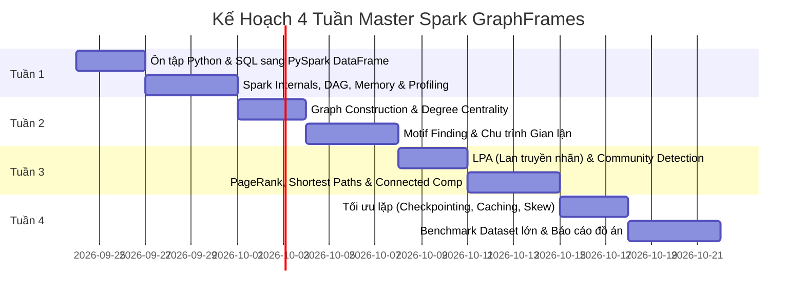

# KẾ HOẠCH HỌC TẬP & NGHIÊN CỨU SPARK GRAPHFRAMES (4 TUẦN)
> **Mục tiêu:** Đưa thành viên từ xuất phát điểm cơ bản (Python lâu chưa dùng, SQL căn bản) trở thành người làm chủ **Apache Spark** và **GraphFrames**, nắm vững bản chất tính toán phân tán và thực thi thành công các thuật toán đồ thị cốt lõi (LPA, PageRank, Connected Components, BFS, Motif Finding).

---

## 🎯 BỐI CẢNH & MỤC TIÊU DỰ ÁN
* **Đối tượng:** Đặng Minh Quân & nhóm nghiên cứu (cùng thầy Đặng & bạn Thành).
* **Môi trường cục bộ:** MacBook Air M3 (Apple Silicon), PySpark `4.0.4`, GraphFrames `0.6` (Spark 4 / Scala 2.13 JAR: `io.graphframes:graphframes-spark4_2.13:0.12.2`), Python 3.9 venv nội bộ (`./venv`).
* **Yêu cầu cốt lõi:**
  1. Nắm chắc tư duy Big Data & cơ chế thực thi của Spark (Lazy Evaluation, DAG, Partitioning, Shuffle, Checkpoint).
  2. Xây dựng và truy vấn đồ thị với GraphFrames (Vertices, Edges, Motif Finding).
  3. Làm chủ và phân tích thuật toán đồ thị phân tán trọng tâm: **Label Propagation Algorithm (LPA)**, **PageRank**, **Connected Components**, **BFS**.
  4. Đạt chuẩn kỹ thuật: Đo lường thời gian (Execution Time), kiểm soát RAM (Memory Profiling qua `psutil`), chống tràn bộ đệm đệ quy (`setCheckpointDir`).

---

## 📅 LỘ TRÌNH CHI TIẾT 4 TUẦN (4-WEEK SYLLABUS)



---

### 🟢 TUẦN 1: TƯ DUY PHÂN TÁN & NỀN TẢNG PYSPARK DATAFRAME
*Mục tiêu: Đưa tư duy SQL/Python truyền thống sang mô hình tính toán phân tán trên DataFrames.*

#### Ngày 1 - 2: Tái khởi động Python & Ánh xạ từ SQL sang PySpark
- **Kiến thức cốt lõi:**
  - Ôn lại Python: Kiểu dữ liệu, Tuples, Dictionaries, List Comprehension, hàm `lambda`, thư viện `collections`.
  - Spark DataFrame chính là SQL trên nền phân tán:
    - `SELECT col1, col2` $\rightarrow$ `df.select("col1", "col2")`
    - `WHERE condition` $\rightarrow$ `df.filter(F.col("age") > 25)`
    - `GROUP BY category COUNT(*)` $\rightarrow$ `df.groupBy("category").count()`
    - `JOIN` $\rightarrow$ `df1.join(df2, "id", "inner")`
    - `WINDOW FUNCTION` $\rightarrow$ `from pyspark.sql.window import Window`
- **Thực hành:**
  - Viết lại các truy vấn SQL phức tạp sang PySpark code sạch trong `src/` sử dụng `pyspark.sql.functions as F`.

#### Ngày 3 - 4: Cơ chế hoạt động của Spark (Spark Internals)
- **Kiến thức cốt lõi:**
  - Kiến trúc Driver vs Executor (Master `local[4]` trên Mac M3).
  - **Lazy Evaluation**: Spark không tính toán ngay mà tạo biểu đồ luồng kế hoạch (Logical Plan $\rightarrow$ Physical Plan $\rightarrow$ DAG).
  - Phân biệt **Transformation** (Narrow: `map`, `filter`; Wide: `groupBy`, `join` gây Shuffle) và **Action** (`count()`, `show()`, `collect()`).
  - Tại sao tránh dùng `collect()` trên dữ liệu lớn (nguy cơ OutOfMemory Driver).
- **Thực hành:**
  - Đọc file văn bản/CSV lớn, dùng `df.explain(True)` để đọc hiểu cây thực thi Catalyst Optimizer.

#### Ngày 5 - 7: Quản trị Bộ nhớ & Khung Đo Lường Hiệu Năng (Profiling)
- **Kiến thức cốt lõi:**
  - Partitioning: Số lượng partition lý tưởng trên Mac M3 (`spark.sql.shuffle.partitions = 4`).
  - Thiết lập module đo lường thời gian thực thi và tài nguyên RAM thông qua `time` và `psutil`.
- **Thực hành:**
  - Tạo script mẫu chuẩn hóa `src/benchmark_template.py` có decorator đo execution time và memory delta.
  - **Kiểm tra cuối tuần 1:** Nắm vững cú pháp PySpark DataFrame, tự tin thao tác dữ liệu không còn ngập ngừng về cú pháp Python.

---

### 🟡 TUẦN 2: XÂY DỰNG ĐỒ THỊ & TRUY VẤN MẪU HÌNH (MOTIF FINDING)
*Mục tiêu: Làm chủ đối tượng GraphFrame, biểu diễn dữ liệu bảng thành đỉnh/cạnh và khai phá cấu trúc mạng.*

#### Ngày 8 - 10: Khởi tạo GraphFrame & Các độ đo cơ bản
- **Kiến thức cốt lõi:**
  - Cấu trúc tiêu chuẩn của GraphFrame:
    - Bảng đỉnh (`vertices`): Bắt buộc có cột khóa `id` duy nhất + các trường thuộc tính.
    - Bảng cạnh (`edges`): Bắt buộc có hai cột `src` và `dst` + các trường trọng số/thời gian.
  - Khái niệm Bậc của đỉnh (Degrees):
    - `g.inDegrees`: Số cạnh hướng tới đỉnh.
    - `g.outDegrees`: Số cạnh bắt nguồn từ đỉnh.
    - `g.degrees`: Tổng liên kết.
- **Thực hành:**
  - Chuyển đổi dữ liệu bảng giao dịch tài chính hoặc tương tác người dùng thành GraphFrame.
  - Lọc và tìm các đỉnh đóng vai trò "Hub" (bậc liên kết vượt trội).

#### Ngày 11 - 14: Khai phá cấu trúc phức tạp bằng Motif Finding (DSL)
- **Kiến thức cốt lõi:**
  - Cú pháp Graph Domain Specific Language: `(a)-[e1]->(b); (b)-[e2]->(c)`.
  - Phân biệt cạnh vô hướng vs cạnh có hướng trong motif.
  - Ứng dụng nghiệp vụ:
    - Chu trình kín 3 bước ($A \to B \to C \to A$): Dấu hiệu rửa tiền / xoay vòng dòng vốn.
    - Cấu trúc lưỡng cực (Bi-directional edges: $A \leftrightarrow B$): Tương tác bạn bè thân thiết.
- **Thực hành:**
  - Nâng cấp notebook [Mini - Prj/mini.ipynb](file:///Users/quandkh/spark_learning/Mini%20-%20Prj/mini.ipynb): Viết thuật toán tìm chu trình $K_3, K_4$, lọc bỏ hoán vị trùng lặp ($a.id < b.id < c.id$).
  - **Kiểm tra cuối tuần 2:** Xây dựng được GraphFrame từ dữ liệu thô, thuần thục cú pháp Motif Finding.

---

### 🟠 TUẦN 3: LÀM CHỦ CÁC THUẬT TOÁN ĐỒ THỊ (TRỌNG TÂM: LPA & PAGERANK)
*Mục tiêu: Chạy thành công và nắm sâu thuật toán theo đúng yêu cầu từ thầy Đăng và bài viết HackerNoon.*

#### Ngày 15 - 17: Thuật toán Lan truyền Nhãn (Label Propagation Algorithm - LPA)
- **Mô hình hóa lý thuyết:**
  - Bài toán: Phân cụm cộng đồng (Community Detection) không cần giám sát (Unsupervised) trên đồ thị quy mô lớn.
  - Thuật toán Raghavan et al. (2007):
    1. Ban đầu, mỗi đỉnh $v \in V$ sở hữu nhãn độc lập: $C_v^{(0)} = v$.
    2. Vòng lặp thứ $t$: Mỗi đỉnh gửi nhãn của nó cho tất cả hàng xóm.
    3. Đỉnh $v$ cập nhật nhãn mới bằng nhãn xuất hiện nhiều nhất trong số các hàng xóm (Majority Voting):
       $$C_v^{(t)} = \operatorname{argmax}_c \sum_{u \in N(v)} \mathbb{I}(C_u^{(t-1)} = c)$$
    4. Dừng khi đạt trạng thái cân bằng hoặc chạm `maxIter`.
- **Thực thi trên GraphFrames:**
  - `communities = g.labelPropagation(maxIter=5)`
  - Nghiên cứu bài viết HackerNoon: *"Determining Communities In Graphs Using Label Propagation Algorithm"*.
  - Thử nghiệm với dữ liệu quan hệ thực tế (Wikipedia Topics, thực thể hoặc tài khoản ngân hàng).
  - Phân tích ưu/nhược điểm: Tốc độ gần tuyến tính $O(k \cdot (|V| + |E|))$, nhưng kết quả có thể không đơn nhất tùy vào thứ tự cập nhật.

#### Ngày 18 - 19: Thuật toán PageRank & Centrality
- **Lý thuyết:**
  - Mô hình bước đi ngẫu nhiên (Random Walk) với hệ số ngắt quãng (Damping factor $\alpha = 0.85$, tương ứng `resetProbability=0.15`).
  - Định giá trị dòng tiền hoặc tầm ảnh hưởng của các nút trung tâm.
- **Thực thi trên GraphFrames:**
  - `pr_df = g.pageRank(resetProbability=0.15, maxIter=10)`
  - Trích xuất điểm `pagerank` để xếp hạng các nút quan trọng nhất.

#### Ngày 20 - 21: Connected Components, Strongly Connected Components & Shortest Paths (BFS)
- **Lý thuyết & Thực thi:**
  - **Connected Components (CC):** Tìm các cụm mạng độc lập trong đồ thị vô hướng. (Lưu ý: GraphFrames dùng thuật toán `two_phase` tối ưu).
  - **Strongly Connected Components (SCC):** Áp dụng cho đồ thị có hướng (mọi đỉnh trong cụm đều có đường đi đến nhau).
  - **Breadth-First Search (BFS):** Tìm đường đi ngắn nhất giữa đỉnh nguồn và đỉnh đích dựa trên biểu thức điều kiện.
  - `g.bfs(from_expr="id = 'ACC_101'", to_expr="account_type = 'Business'", maxPathLength=5)`
  - **Kiểm tra cuối tuần 3:** Chạy độc lập và giải thích tường tận nguyên lý hoạt động của LPA, PageRank và Connected Components cho thầy và nhóm.

---

### 🔴 TUẦN 4: TỐI ƯU HÓA PHÂN TÁN, BENCHMARK QUY MÔ LỚN & ĐÓNG GÓI
*Mục tiêu: Đưa dự án đạt tiêu chuẩn nghiên cứu/kỹ thuật cao cấp: Xử lý nghẽn bộ nhớ, benchmark tập dữ liệu lớn và báo cáo.*

#### Ngày 22 - 24: Kỹ thuật sống còn trong Thuật toán Đồ thị lặp (Iterative Computation)
- **Lỗi kinh điển:** `StackOverflowError` trong JVM khi chạy thuật toán lặp qua nhiều bước (LPA, PageRank, CC).
  - **Nguyên nhân:** DAG của Spark kéo dài vô hạn (Lineage graph quá dài), mỗi vòng lặp chồng thêm một lớp RDD phụ thuộc.
  - **Giải pháp:** Thiết lập thư mục Checkpoint:
    ```python
    spark.sparkContext.setCheckpointDir("/tmp/spark-checkpoints")
    ```
    Checkpoint sẽ ghi dữ liệu xuống đĩa cứng và chặt đứt chuỗi DAG lineage, giải phóng bộ nhớ Driver.
- **Hiện tượng Data Skew (Đỉnh siêu sao):**
  - Một đỉnh kết nối hàng triệu đỉnh khác sẽ bị dồn vào 1 partition duy nhất $\rightarrow$ Executor bị chậm hoặc OOM.
  - Chiến lược cách ly và phân vùng lại (Salting, Partition Pruning).

#### Ngày 25 - 26: Thử nghiệm với Dataset quy mô lớn (Large-Scale Benchmark)
- Tải dataset chuẩn từ Stanford SNAP (ví dụ: `email-Eu-core`, `facebook_combined` hoặc `amazon0302`).
- Đo lường:
  - Thời gian hội tụ của LPA theo số lượng vòng lặp (`maxIter = 5, 10, 20`).
  - Mức tiêu hao RAM đỉnh điểm (Peak RAM usage) qua `psutil`.

#### Ngày 27 - 28: Đóng gói Codebase & Báo cáo hoàn thiện
- Đóng gói mã nguồn dạng module vào thư mục `src/` (OOP / Functional pipelines).
- Viết file `notebooks/` trình bày trực quan kết quả (biểu đồ phân phối nhãn cộng đồng, đồ thị tương tác).
- Chuẩn bị slide báo cáo ngắn gọn cho thầy Đăng và nhóm nghiên cứu.
- Đẩy toàn bộ mã nguồn lên GitHub.

---

## 🛠️ KHUNG SUY LUẬN 4 BƯỚC CHO MỌI BÀI TOÁN ĐỒ THỊ
Mỗi khi thi công một giải thuật trên GraphFrame, luôn áp dụng 4 bước chuẩn mực sau:

| Bước | Nội Dung | Ví Dụ Áp Dụng Cho LPA |
| :--- | :--- | :--- |
| **1. Mô hình hóa bài toán** | Đưa về đồ thị $G = (V, E)$. Xác định rõ thuộc tính của đỉnh và cạnh. | $V$: Các tài khoản/nút nội dung. $E$: Tương tác giao dịch/liên kết. |
| **2. Xác lập tiệm cận** | So sánh baseline (duyệt đơn luồng BFS/DFS $O(V+E)$) với giải thuật phân tán. | Phân tán hoá qua cơ chế Message Passing song song của Spark. |
| **3. Bất biến & Độ phức tạp** | Chỉ ra Loop Invariant và phân tích Big-O Time & Space. | Mỗi vòng lặp $O(E)$, dừng sau $k$ bước $\rightarrow O(k \cdot E)$. Space: $O(V)$ cho bảng nhãn. |
| **4. Kiểm thử đối nghịch** | Edge cases: Đồ thị rỗng ($V=0$), đồ thị không liên thông, đỉnh cô lập, chu trình vô hạn. | Kiểm tra xem các đỉnh cô lập (`degree = 0`) có giữ nguyên nhãn gốc không. |

---

## 📌 LỊCH TRÌNH HỌC HÀNG NGÀY (DAILY ROUTINE GỢI Ý)
* **Thời lượng:** 1.5 - 2 giờ / ngày.
  - **30 phút đầu:** Đọc lý thuyết / tài liệu sách có sẵn trong `self-study books/` (Đặc biệt: Sách *Learning Spark* chương GraphX/GraphFrames hoặc bài viết HackerNoon).
  - **60 phút giữa:** Code thực chiến trực tiếp trên VS Code / Jupyter Notebook, kiểm tra lỗi và đọc logs Spark UI (`http://localhost:4040`).
  - **15 - 30 phút cuối:** Refactor code vào `src/`, ghi chú (Notes) và commit tiến độ lên Git.
